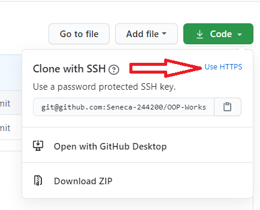
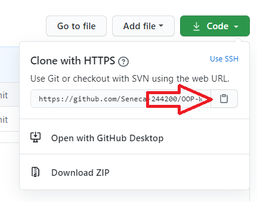

# OOP244-NABC-Notes
## Active Session
You are welcome to Fardad's classes as a guest by **using your real Seneca Name** (what is on your student card, otherwise you will be kicked out). Click on the link below to join: (See [my schedule](#fardads-schedule) for lecture times)<br />
[OOP244 active session by Fardad](https://connect.rna2.blindsidenetworks.com/invite/to?c=kVkVeFXOytb5gyLIhlsXlyQvGbrSAteP2yExovQ9P3E&m=0accc1901cdc1c5c5dde9f1c273b291f0c8fee37&t=1624474599464&u=senecacollege)
## Previous Sessions
### NAA
- [01- Intro - May 18](https://recordings.rna2.blindsidenetworks.com/senecacollege/2678bf2924dbb7a732270ba3291a4147ab317b76-1621345789706/capture/)
- 02- OOP - Objects, Modular prg, Hello everyone presentations (Private) [Last semester's recording](https://recordings.rna2.blindsidenetworks.com/senecacollege/b01cb843fdb89e5626de49755e50a2f7b28d2ef4-1611067513384/capture/)
- [03 - Workshop 1 Q&A, Types, overloading, References, DMA](https://recordings.rna2.blindsidenetworks.com/senecacollege/2678bf2924dbb7a732270ba3291a4147ab317b76-1621950338078/capture/)
- [04 - References, DMA](https://recordings.rna2.blindsidenetworks.com/senecacollege/2678bf2924dbb7a732270ba3291a4147ab317b76-1622116459755/capture/)
- [05 - References, DMA Q&A, Member Functions](https://recordings.rna2.blindsidenetworks.com/senecacollege/2678bf2924dbb7a732270ba3291a4147ab317b76-1622555402469/capture/)
- [06 - DMA, Member Functions, Privacy, Construction and destruction](https://recordings.rna2.blindsidenetworks.com/senecacollege/2678bf2924dbb7a732270ba3291a4147ab317b76-1622721506825/capture/)
### NBB
- [01 -Intro - May 19](https://recordings.rna2.blindsidenetworks.com/senecacollege/0d8bcf501683686149a744be030f2997f653c324-1621352393794/capture/)
- 02- OOP - Objects, Modular prg, Hello everyone presentations (Private) [Last semester's recording](https://recordings.rna2.blindsidenetworks.com/senecacollege/38d0354c4d4583be98c7cd8a39e2681ad8d1768a-1611073970531/capture/)
- [03 - Workshop 1 Q&A, Types, overloading, References, DMA](https://recordings.rna2.blindsidenetworks.com/senecacollege/0d8bcf501683686149a744be030f2997f653c324-1621956613515/capture/)
- [04 - References, DMA](https://recordings.rna2.blindsidenetworks.com/senecacollege/0d8bcf501683686149a744be030f2997f653c324-1622229579428/capture/)
- [05 - References, DMA Q&A, Member Functions](https://recordings.rna2.blindsidenetworks.com/senecacollege/0d8bcf501683686149a744be030f2997f653c324-1622562084696/capture/)
- 06 - Cancelled class of DMA, Member Functions, Privacy, Construction and destruction <br />[View Section NAA recording](https://recordings.rna2.blindsidenetworks.com/senecacollege/2678bf2924dbb7a732270ba3291a4147ab317b76-1622721506825/capture/)<br />[View Section NCC recording](https://recordings.rna2.blindsidenetworks.com/senecacollege/fb366ce0c7238e837d20dd751775ac67833315a0-1622827341857/capture/)
### NCC
- [01 -Intro - May 19](https://recordings.rna2.blindsidenetworks.com/senecacollege/fb366ce0c7238e837d20dd751775ac67833315a0-1621451764757/capture/)
- 02- OOP - Objects, Modular prg, Hello everyone presentations (Private)  [Last semester's recording](https://recordings.rna2.blindsidenetworks.com/senecacollege/38d0354c4d4583be98c7cd8a39e2681ad8d1768a-1611073970531/capture/)
- [03 - Workshop 1 Q&A, Types, overloading, References, DMA](https://recordings.rna2.blindsidenetworks.com/senecacollege/fb366ce0c7238e837d20dd751775ac67833315a0-1622056781250/capture/)
- [04 - References, DMA](https://recordings.rna2.blindsidenetworks.com/senecacollege/fb366ce0c7238e837d20dd751775ac67833315a0-1622222673875/capture/)
- [05 - References, DMA Q&A, Member Functions](https://recordings.rna2.blindsidenetworks.com/senecacollege/fb366ce0c7238e837d20dd751775ac67833315a0-1622661093271/capture/)
- [06 - DMA, Member Functions, Privacy, Construction and destruction](https://recordings.rna2.blindsidenetworks.com/senecacollege/fb366ce0c7238e837d20dd751775ac67833315a0-1622827341857/capture/)

# Fardad's Schedule
| Period | Start-Stop  | Mon | Tue | Wed | Thu | Fri |
|--------|-------------|-----|-----|-----|------|------|
| 1      | 8:00-8:50   | |||OOP244 NAA Lecture| |
| 2      | 8:55-9:45   | |||OOP244 NAA Lecture| |
| 3      | 9:50-10:40  | |OOP244 NAA (Lecture/Q&A)| |[Office](https://teams.microsoft.com/l/team/19%3a600e885e862c434ba63910c5faf7e5e5%40thread.tacv2/conversations?groupId=b035bc40-2cb5-4c60-b4aa-a569067859b2&tenantId=eb34f74a-58e7-4a8b-9e59-433e4c412757)| |
| 4      | 10:45-11:35 | |OOP244 NAA (Lecture/Q&A)| |[Office](https://teams.microsoft.com/l/team/19%3a600e885e862c434ba63910c5faf7e5e5%40thread.tacv2/conversations?groupId=b035bc40-2cb5-4c60-b4aa-a569067859b2&tenantId=eb34f74a-58e7-4a8b-9e59-433e4c412757)| |
| 5      | 11:40-12:30 | |OOP244 NBB (Lecture/Q&A)| | | |
| 6      | 12:35-13:25 | |OOP244 NBB (Lecture/Q&A)| | | |
| 7      | 13:30-14:20 | | | | |OOP244 NCC Lecture|
| 8      | 14:25-15:15 | | | | |OOP244 NCC Lecture|
| 9      | 15:20-16:10 | | |OOP244 NCC (Lecture/Q&A)| |OOP244 NBB Lecture|
| 10     | 16:16-17:05 | | |OOP244 NCC (Lecture/Q&A)| |OOP244 NBB Lecture|
| 11     | 17:10-18:00 | | | | | |
| 12     | 18:05-18:55 | | | | | |

## IPC144/BTP100 Review Session for OOP244/BTP200 Students
The review session on IPC144/BTP100 was held on May 13th, 10 AM to 5:20 PM (7 hours and 20 minutes long). <br />
This session was open to all the students who needed to review the 144/100 concepts before starting 244/200 subjects.<br />

### Review Recordings
[144/100 for 244/200 Review session](https://recordings.rna2.blindsidenetworks.com/senecacollege/f2f6a54f9f645d3f6c67dcc4a92dcade141b9b99-1620913137318/capture/)

The recording is 5 hours and 2 minutes long (skipping the recess periods).<br />
Here are the timestamps for the main topics covered: (Thank you **Chung On Tse**, for providing the timestamps)<br />

- 0:00:00 Introduction, Git 
- 0:17:00 computer, cpu, bits, bytes
- 0:22:00 ASCII, characters
- 0:26:00 addresses
- 0:30:00 segmentation fault
- 0:38:00 high-level language, flow chart presentation: compiler
- 0:51:00 data types
- 1:13:00 escape sequences
- 1:16:00 character arrays
- 1:27:00 Assignment right-to-left
- 1:42:00 arrays
- 1:52:00 integral operands
- 1:55:00 logical expressions
- 2:09:00 functions, if-else
- 2:30:00 selection constructs, if-else
- 2:37:00 case and switch
- 2:41:00 how to write functions with one return statement
- 2:54:00 conditional expression
- 3:12:00 flags
- 3:23:00 pointers - presentation
- 3:55:00 arrays
- 4:10:00 structs and passing by address
- 4:27:00 files
- 4:45:00 string library, string.h
- 4:51:00 2 Dim. arrays
### Review Session Codes
[144/100 for 244/200 Session Notes](https://github.com/Seneca-244200/OOP244NABC-Notes/tree/main/144For244Review)


# Computer preparation and Getting Workshop files
## Setting up your computers for OOP244

Follow the instructions in the "How To" videos before reading the rest of these guidelines<br />
Installation guides for preparing your computer for the subject can be found in this playlist on YouTube:<br />
[Seneca-SDDS "how to" videos for C/C++ Core subjects](https://www.youtube.com/playlist?list=PLxB4x6RkylosAh1of4FnX7-g2fk0MUeyc)<br />
OR:<br />
Go to this url: https://tinyurl.com/244setup 


## Getting Workshop files
(if you have not followed the Installation guides to prepare your computer go to **Using [Download Zip](#using-download-zip)**)<br />

### Using [Git](https://git-scm.com/download/win)
- Open https://github.com/Seneca-244200/OOP-Workshops and click on “Code” Button; this will open “Clone with HTTPS” window.<br />

> If the window is titled “Clone with SSH” then click on “Use HTTPS”: <br />

- Copy the https URL by clicking on the button on the right side of the URL:<br />
- Open File Explorer on your computer and select or create a directory for your workshops.
#### Using [ToroiseGit](https://tortoisegit.org/download/)
- Right click on the selected directory and select “Git Clone":<br /> <br />
-This will open the “Git Clone” window with the URL already pasted in the “URL” text box; if not, paste the URL manually:<br /> <br />
- Click on ok<br />
This will create on your computer a clone (identical directory structure) of the directory on Github.  Once you have cloned the directory, you can open the workshop directory **OOP-Workshops/WS??** and start doing your workshop. Note that you will repeat this process for all workshops and milestones of your project in this subject.
> If your professor makes any changes to the workshop or a new workshop is released, you can right click on the cloned repository directory and select **Tortoise Git/pull** to update and sync your local workshops repositoryy to the one on Github with-out having to download it again. Note that this will only apply the changes made and will not affect any work that you have done on your workshop.
#### Using Command line
- Open the git command line on your computer.
- Change the directory to your workshops directory.
- Issue the following command at the command prompt in your workshops directory: 
``` bash
git clone https://github.com/Seneca-244200/OOP-Workshops.git<ENTER>
```
> The URL for all the workshops are the same throughout the semester. The only thing that changes, is the workshop number.<br/>

This will create a clone (that is an identical directory structure and content to the one Github) of the OOP-Workshops repository on your computer.  Once you have cloned the directory, you can open the subdirectory the workshop and start doing your work. Note that you will repeat this process for all workshops and milestones of your project in this subject.

> If your professor makes any changes to the workshop, you can issue the command
``` bash 
git pull<ENTER>
``` 
>  in the cloned repository directory to update and sync your local workshop to the one on Github without having to download it again. Note that this will only apply the changes made and will not affect any work that you have done on your workshop.

#### Using Download ZIP
- Open https://github.com/Seneca-244200/OOP-Workshops  and click on “Code” button and click on “Download ZIP”.<br />
<br />
- This will download a zipped file copy of the workshop repository from Github to your computer. You can extract this file to where you want to do your workshop. <br />
> Note that, if your professor makes any changes to the workshop, to get them you have to separately download another copy of the workshop and manually apply the changes to your working directory to **make sure nothing of your work is overwritten by mistake**.
